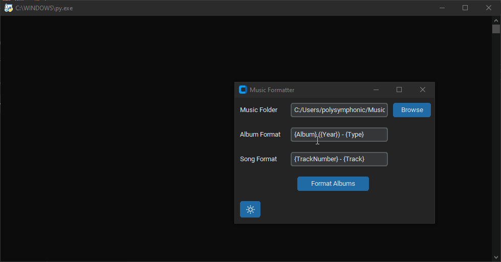
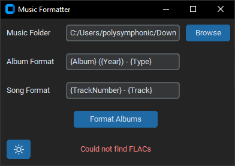
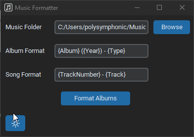
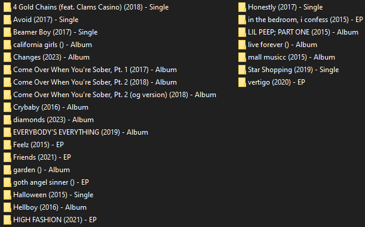

# Polysymphonic Music Formatter


Organize your music collection by renaming folders and files using customizable formats.

# Table of Contents

1. [Polysymphonic Music Formatter](#polysymphonic-music-formatter)
   - [Features](#features)
   - [Installation](#installation)
   - [Usage](#usage)
     - [Formatting](#formatting)
       - [Album](#album)
       - [Song](#song)
   - [Album Format Template](#album-format-template)
   - [Song Format Template](#song-format-template)
   - [Supported Audio File Formats](#supported-audio-file-formats)
   - [Gallery](#gallery)
   - [Contributing](#contributing)
   - [License](#license)


## Features

* Rename folders based on album metadata (artist, album, year, type)
* Rename music files based on track metadata (track number, track title, artist, album artist)
* Customizable naming formats for both folders and files
* Uses placeholder tags to format folders and files
~~*Supports various audio formats (FLAC, MP3, M4A, WAV)~~
Only supports .flac currently, ID3 is a nightmare.

## Installation

1. Install Python 3.7 or higher.
2. Install the required Python libraries:
```bash
pip install tkinter ttk mutagen configparser
```

## Usage

1. Run (or open) `formatter.py`.
2. Select the root directory containing your music folders.
3. Enter the desired album format template.
4. Enter the desired song format template.
5. Click the "Format Albums" button.
### Formatting
#### Album

The album format template uses placeholder tags that will be replaced with actual album information:

- `{Album}`: Album title
- `{Artist}`: Album artist
- `{Year}`: Year of release
- `{Type}`: Album type (Album, EP, Single)

#### Song

The song format template uses placeholder tags that will be replaced with actual track information:

- `{TrackNumber}`: Track number
- `{Track}`: Track title
- `{Artist}`: Track artist
- `{AlbumArtist}`: Album artist

## Supported Audio File Formats

The script currently supports the following audio formats:

- FLAC (.flac)
- ~~MP3 (.mp3)~~
- ~~OGG (.ogg)~~
- ~~M4A (.m4a)~~
- ~~WAV (.wav)~~

## Gallery







## Contributing

Feel free to contribute to this project by submitting bug reports, feature requests, or pull requests.

## License

This project is licensed under the MIT License.
